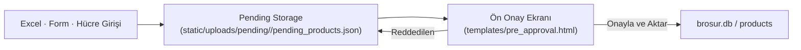
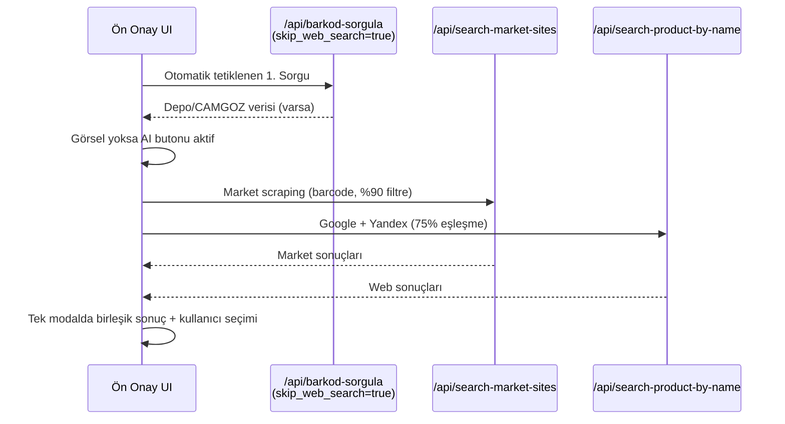
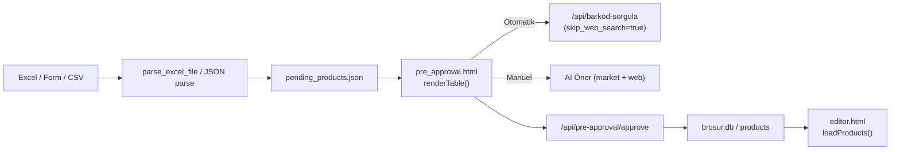
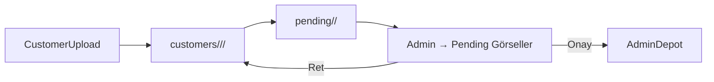

# 📘 Market Broşür Sistemi Anayasası

Bu doküman, Market Broşür Sistemi'nin işletim prensiplerini, veri akışlarını, sorgu ağaçlarını ve sorumluluk alanlarını özetleyen kalıcı rehberdir. Yeni geliştirmeler veya hata incelemeleri sırasında referans olarak kullanılmalıdır.

---

## 1. Sistem Genel Bakış

- **Backend:** Flask + Blueprint mimarisi (`app.py`, `routes/`).  
- **Veri katmanı:** SQLite (`brosur.db`) ve kullanıcıya özel pending JSON dosyaları.  
- **Frontend:** `templates/pre_approval.html` ağırlıklı vanilla JS; Canvas editörü Fabric.js tabanlı.  
- **Dosya sistemi:** `static/uploads/{admin,customers,pending,cache}` altında çok katmanlı görsel bankası.  
- **Ana akış:** Ürün yükleme → Pending depo → Ön onay ekranı → "Onayla ve Aktar" → Veritabanı / Canvas.  
- **Sorgu stratejisi:** 1. Sorgu (depo + CAMGOZ) otomatik, 2. Sorgu (AI Öner) manuel.



---

## 2. Roller ve Yetkiler

| Rol | Görünüm | Yetkiler | Not |
| --- | --- | --- | --- |
| **Admin** | `templates/admin_dashboard.html` | Kullanıcı/ürün yönetimi, görsel onayı, fiyat verilerini görüntüleme | Admin depo (`static/uploads/admin`) tekil gerçek kaynaktır. |
| **Müşteri** | `templates/index.html`, `pre_approval.html`, `editor.html` | Ürün ekleme, ön onaydan Canvas'a aktarma, AI özellikleri | CAMGOZ fiyat bilgileri müşteriye gösterilmez. |

- Oturumlar güvenli cookie yapısı ile yönetilir (`app.py`: `SESSION_COOKIE_HTTPONLY=True`, `SameSite=Lax`, 24 saat ömür).  
- Rate limiting (`flask_limiter`) login ve API uçlarında aktif (`app.py`).  
- CSRF altyapısı hazır (Flask-WTF), HTML formları için devreye alınabilir.

---

## 3. Ürün Yönetimi İş Akışı

### 3.1 Ürün Kaynakları

| Kaynak | Dosya / Endpoint | Açıklama |
| --- | --- | --- |
| **Excel Yükleme** | `/api/pre-approval/upload-excel` (`routes/products.py`) | FormData ile `.xlsx` yüklenir, validasyon sonrası pending JSON'a yazılır. Sayfa yenilenmez, `loadPendingProducts()` tetiklenir. |
| **CSV Yükleme** | `/api/pre-approval/upload-csv` | Aynı pending deposuna yazar, 5 MB limit. |
| **Standalone Form** | `static/moduller/urun-yukle-formu/index.html` → `/api/pre-approval/import` | Form doldurulduğunda JSON olarak gönderilir, pending'e eklenir. |
| **Müşteri Panel Formu** | `templates/musteri_form.html` → `/api/musteri-form/submit` | Minimum alan doğrulaması (barkod, indirimli fiyat > 0). |
| **Manuel Satır** | Ön onay ekranındaki "Add Row" butonu (`btn-add-row`) | Boş satır eklenir, barkod hücresine veri girildiğinde otomatik sorgu tetiklenir. |

### 3.2 Pending Deposu

- Konum: `static/uploads/pending/<user_id>/pending_products.json`.  
- Yapı: Her ürün `barcode`, `name`, `normal_price`, `discount_price`, `product_group`, `image_url`, `status` alanlarıyla tutulur.  
- Güncellemeler:
  - Excel/Form yükleme: aynı barkod varsa güncellenir, yoksa eklenir.  
  - `/api/pre-approval/update-product`: 1. sorgu çıktıları veya manuel düzenleme pending'e işlenir.  
  - `/api/pre-approval/pending-products`: Ön onay ekranına veri sağlar.  
  - `/api/pre-approval/clear-pending`: Canvas'a aktarılmadan sayfa kapanırsa temizler.

### 3.3 Ön Onay Ekranı (`templates/pre_approval.html`)

- **Başlangıç durumu:** Pending boşsa 2 satır ile açılır, üst toolbar'da "Satır Ekle" butonu vardır.  
- **Kolon yapısı:** Resim, Barkod, Ürün Adı, İndirimli Fiyat, Normal Fiyat, Ürün Grubu, Görsel Durumu, Sayfa ataması.  
- **Otomatik akışlar:**
  - `loadPendingProducts()` → render → `autoQueryMissingProducts()`; Excel sonrası otomatik tetiklenir.  
  - Barkod hücresine blur/focus-out veya scanner ile giriş → `handleBarcodeChange` → `queryBarcodeAndUpdate`.  
  - Görseli olan ürünlerde `AI Öner` butonu disable edilir, tooltip'te mevcut olduğu belirtilir.  
  - Hover önizleme (`.product-image-hover`) modalı sol yan olmak üzere reposition edildi.  
- **Kayıt:** "Onayla ve Aktar" → `/api/pre-approval/approve`, validasyon sonrası `brosur.db`'ye yazar ve Canvas'a aktarılacak payload döner.

### 3.4 Onay & Aktarım

`routes/products.py::api_pre_approval_approve`

1. Pending'deki seçilen ürünler JSON olarak gönderilir.  
2. `validate_and_fix_product_group` ile grup isimleri sektör bazlı whitelist'e oturtulur; tanımsız grup `Genel` olur.  
3. Aynı barkod müşteride mevcutsa güncellenir, yoksa `database.add_product` ile eklenir.  
4. Kaydedilen ürünler Canvas editörüne taşınır, `sessionStorage.setCanvasTransferred()` flag'i true olur.  
5. Pending JSON temizlenir.

---

## 4. Barkod Sorgulama Sistemi

### 4.1 Otomatik Sorgu (1. Sorgu Ağacı)

- **Tetikleyiciler:**
  1. Excel veya form import tamamlandıktan hemen sonra (`autoQueryMissingProducts()`).
  2. Barkod hücresine manuel giriş / blur.
  3. Standalone formdaki "Sorgula" aksiyonu.
- **Sorgu sırası:**  
  `Müşteri Deposu → Admin Deposu → CAMGOZ API`  
  *Google/Web araması kesinlikle yoktur.*
- **Teknik:** `/api/barkod-sorgula` çağrısı `skip_web_search: true` parametresiyle yapılır. `services/external_api.full_barcode_lookup` CAMGOZ sonucunu cache'ler, resim yoksa manuel yükleme beklenir.
- **UI davranışı:**  
  - Satır highlight olur, focus barkod hücresine taşınır, 0.5 sn gecikme ile sıradaki ürüne geçilir.  
  - Bulunan ürünler yeşil, bulunamayanlar sarı/kırmızıyla işaretlenir ve pending JSON güncellenir.

### 4.2 Manuel Sorgu (2. Sorgu – AI Öner Butonu)

- **Tetikleyici:** Kullanıcı aktif olarak "AI Öner" butonuna basar. Buton, üründe resim varsa disable edilir.  
- **Kaynak seti:**
  - Web scraping: `asyasanalmarket.com`, `marketkarsilastir.com`, `eonbir.com.tr`, `aykanlarkapida.com`, `evkiba.com` (+ isteğe bağlı Migros, A101, BİM yedekleri) [`services/market_scraper.py`].  
  - Görsel API: Google Custom Search + Yandex (DuckDuckGo backend) [`services/external_api.py::search_product_by_name`].  
- **Filtreler:**
  - Market sonuçları için `%90` benzerlik (isim–sorgu) eşiği, `SequenceMatcher`.  
  - Google/Yandex sonuçlarında `calculate_relevance_score`, maksimumun %75'i altı elenir, negatif sonuçlar atılır.  
  - Kaynak adları modaldan kaldırıldı; sadece "🔍 X görsel bulundu" + kalite rozeti gösterilir.
- **Akış:** Frontend `searchCombinedWebSources()` ile `/api/search-market-sites` ve `/api/search-product-by-name` çağrılarını paralel yapar, sonuçları tek modalda birleştirir. Kullanıcı seçim yaparsa `uploadImageForProduct` üzerinden pending + depot güncellenir.



### 4.3 Fallback: PC'den Yükleme

- `📁 PC` butonu her üründe aktiftir.  
- Kullanıcı dosya seçer → `uploadImageForProduct` → `services/image_bank.save_to_customer_depot` → pending + müşteri deposu güncellenir, admin onay kuyruğuna düşer.

---

## 5. Görsel Yönetimi

### 5.1 Depo Yapısı

| Konum | Amaç | Yetki |
| --- | --- | --- |
| `static/uploads/customers/<user>/<sector>/<barcode>/` | Müşteri özel görselleri | Müşteri yükler, onay bekler. |
| `static/uploads/admin/<sector>/<barcode>/` | Onaylanmış "golden" görseller | Admin veya otomatik onay. |
| `static/uploads/pending/<sector>/<barcode>/` | Onay kuyruğu | Admin panelde görüntülenir. |
| `static/uploads/pending/<user>/pending_products.json` | Ürün verileri (tablo) | Ön onay ekranı state'i. |
| `static/uploads/cache/<barcode>_camgoz.json` | CAMGOZ cache | `full_barcode_lookup` tarafından yönetilir. |

### 5.2 Arama Hiyerarşisi

1. `search_image_hierarchy` müşteri deposunu kontrol eder.  
2. Bulunamazsa admin deposuna bakar.  
3. Resim yoksa otomatik sorgu CAMGOZ datasıyla yetinir (Google'a gitmez).  
4. Manuel istek olursa AI Öner/market scraping devreye girer.  
5. Son çare: manuel yükleme.

### 5.3 Standartlaştırma & Metadata

- `services/image_bank.standardize_image` tüm görselleri RGBA/PNG formatına çevirir, 1024px ceiling.  
- Kaydedilen her görsel için `metadata.json` oluşturulur (user_id, sektör, yükleme zamanı, durum).  
- Admin onayı sonrası müşteri kopyası kaldırılıp admin deposuna taşınır, metadata `approved_at` ekler.  
- Red durumunda müşteri metadata'sı `status='rejected'` olarak güncellenir.

---

## 6. Veri Akışları

### 6.1 Excel/Form → Ön Onay → Canvas



### 6.2 Görsel Onay Kuyruğu



---

## 7. API Entegrasyonları

| Kaynak | Dosya/Fonksiyon | Kullanıldığı Yer | Not |
| --- | --- | --- | --- |
| **CAMGOZ / JoJAPI** | `services/external_api.query_camgoz_api` | 1. sorgu | Ürün adı, kategori, piyasa fiyatı; cache'lenir. |
| **Google Custom Search** | `search_with_google` | AI Öner | `GOOGLE_API_KEY`, `GOOGLE_SEARCH_CX` gerekir (100/gün). |
| **Yandex (DDGS)** | `search_with_yandex` | AI Öner | Türk ürünlerinde yüksek eşleşme, rate limit 0.5s delay ile tolere edilir. |
| **Market Scrapers** | `services/market_scraper` | AI Öner | asyasanalmarket & marketkarsilastir zorunlu, Migros/A101/BİM opsiyonel. |
| **OpenAI** | `ai_service.py`, `routes/ai.py` | Slogan, görsel öneri, Hayalet Asistan | `.env`'de `OPENAI_API_KEY` zorunlu. |
| **Ghost Assistant** | `services/ghost_assistant.py` | Tasarım analizi | Ürün ve broşür metrikleri için `database` ve external API verilerini kullanır. |

---

## 8. Veritabanı Yapısı (SQLite)

| Tablo | Önemli Alanlar | Açıklama |
| --- | --- | --- |
| `users` | `email`, `role`, `sector`, `credits` | Admin/müşteri rolleri. |
| `products` | `user_id`, `barcode`, `name`, `product_group`, `normal_price`, `discount_price`, `image_url`, `market_price*` | "Onayla ve Aktar" sonrası doldurulur. |
| `customer_images` / `admin_images` | `barcode`, `image_url`, `approved` | Depo yönetimi. |
| `admin_products` | Golden record + kalite ölçümleri. |
| `barcode_verifications` | Web aramalarından gelen verileri doğrulamak için cache. |
| `customer_custom_products`, `customer_credits`, `user_settings` | Müşteri özelleştirmeleri ve kredi sistemi. |

(*Market fiyat alanları admin görünümünde raporlanır.*)

---

## 9. Dosya Sistemi Organizasyonu

```
market-brosur-sistemi/
├── app.py (Flask giriş)
├── routes/
│   ├── products.py (ön onay, sorgu uçları)
│   ├── admin.py, auth.py, brochure.py, ghost.py ...
├── services/
│   ├── external_api.py (CAMGOZ + web arama)
│   ├── market_scraper.py (manuel kaynaklar)
│   ├── image_bank.py (depolar)
│   └── excel_io.py, brochure_engine.py, ghost_assistant.py ...
├── templates/
│   ├── pre_approval.html (ön onay UI)
│   ├── editor.html, admin_dashboard.html, musteri_form.html ...
├── static/
│   ├── css/, js/, moduller/
│   └── uploads/
│       ├── admin/
│       ├── customers/
│       ├── pending/
│       └── cache/
└── data/, attached_assets/, requirements.txt, README.md
```

---

## 10. İş Kuralları & Kararlar

1. **Veri kaydı kontrolü:** Hiçbir ürün veritabanına pending onayı olmadan yazılamaz.  
2. **1. Sorgu** sadece depo + CAMGOZ; Google/web çağırmak için mutlaka manuel kullanıcı aksiyonu gerekir.  
3. **AI Öner butonu** görseli olan ürünlerde disable; tooltip "Resim mevcut" gösterir.  
4. **Tablo kolonları:** İndirimli ve Normal fiyat kolonları zorunlu; normal fiyat müşteride çizgili, admin panelde `Satış Fiyatı`.  
5. **Grup alanı:** CAMGOZ `category` değeri `product_group` olarak yazılır; whitelist dışı grup `Genel`.  
6. **Sayfa temizliği:** Sayfa her açıldığında pending kontrol edilir; pending yoksa sessionStorage temizlenir ve tablo 2 boş satırla başlar.  
7. **Excel upload** sayfa yenilemez; `loadPendingProducts()` UI'ı günceller ve `autoQueryMissingProducts()` devreye girer.  
8. **Görsel hover** modalı yana açılır, içeriği kapatmaz.  
9. **Piyasa fiyatı** müşteriye gösterilmez; admin panelde `Satış Fiyatı` kolonuna eşlenir.

---

## 11. Kullanım Senaryoları

1. **Excel ile toplu yükleme**
   - Admin panel → Ön Onay ekranı → Excel seç → Upload → Tablo otomatik dolar → 1. sorgu tetiklenir → Eksik görseller için AI Öner → "Onayla ve Aktar".
2. **Form üzerinden müşteri gönderimi**
   - Müşteri `musteri_form.html` veya modül linkini kullanarak ürünleri girer → `/api/pre-approval/import` → Pending JSON → Admin ön onay ekranında belirir.
3. **Barkod scanner ile manuel giriş**
   - Barkod alanına odaklan → Scanner ile okut → Debounce 500 ms → 1. sorgu → CAMGOZ bulunamazsa satır sarı kalır, kullanıcı AI Öner'e yönlendirilir.
4. **AI Öner ile görsel bulma**
   - Görseli olmayan üründe butona bas → Modal açılır → Market + Google/Yandex sonuçları listelenir → Ön izleme (hover) yana açılır → Seç ve kaydet.  
5. **PC'den manuel görsel**
   - `📁 PC` butonu → Dosya seç → Otomatik olarak müşteri deposuna kaydedilir, admin onay kuyruğuna düşer.
6. **Broşür üretimi**
   - Onaylanan ürünler Canvas editöre aktarılır → Fabric.js ile düzenleme → PNG/PDF export.

---

## 12. Hata Yönetimi & Debugging

- **Loglar:** Flask logları terminalde; `logging.info/warning/error` çağrıları kritik akışları not eder.  
- **Cache sorunları:** `/services/external_api.clear_cache(barcode)` kullanarak CAMGOZ cache temizlenebilir.  
- **Excel validasyonu:** İlk 10 hata mesajı UI bildiriminde gösterilir.  
- **Pending kilitlenmesi:** Gerekirse `/api/pre-approval/clear-pending` çağrısı (sayfa kapanışında otomatik).  
- **Web arama hataları:** AI modalı kırmızı uyarı gösterir, PC yükleme fallback önerilir.  
- **Rate limit:** Google API 403 dönerse UI log'u "limit doldu" mesajı gösterir; Yandex için 0.5 s gecikme var.

---

## 13. Performans & Optimizasyon

- **Debounce / Delay:** Barkod sorgularında 500 ms debounce, otomatik query döngüsünde 0.5 s bekleme var; rate limit ve CAMGOZ yükü azaltır.  
- **Parallelism:** AI Öner market scraping ve Google/Yandex çağrılarını `Promise.all` ile paralel yapar.  
- **Cache:** CAMGOZ sonuçları `static/uploads/cache` altında JSON olarak saklanır; `_get_from_cache` ilk bakılan nokta.  
- **Lazy UI:** Tablo satırları DOM'a gerektiğinde yeniden render edilir; resim hover'ları `requestAnimationFrame` ile optimize edilmiştir.  
- **Resim boyutları:** `standardize_image` ile 1024px tavan, optimize PNG kaydı.

---

## 14. Güvenlik & Ortam Değişkenleri

- `SESSION_SECRET` (zorunlu) – yoksa `app.py` random üretir (development).  
- `OPENAI_API_KEY` – AI servisleri, Ghost Assistant.  
- `CAMGOZ_API_KEY` – barkod sorgusu için ana kaynak.  
- `GOOGLE_API_KEY` + `GOOGLE_SEARCH_CX` – manuel web araması.  
- (Opsiyonel) `N11_API_KEY`, `TRENDYOL_API_KEY` vb. – hazır hook'lar pasif halde.  
- Dosya yüklemelerinde `secure_filename` kullanılır, `.xlsx`/`.csv` kontrolleri vardır.  
- Rate limiting + security headers (`X-Frame-Options`, `X-Content-Type-Options`, `X-XSS-Protection`) `app.py` içinde set edilir.

---

## 15. Referans Endpoint & Fonksiyon Haritası

| Fonksiyon / Endpoint | Dosya | Açıklama |
| --- | --- | --- |
| `/api/pre-approval/upload-excel` | `routes/products.py` | Excel dosyasını pending'e yazar. |
| `/api/pre-approval/pending-products` | `routes/products.py` | Ön onay ekranına pending verisi sağlar. |
| `/api/barkod-sorgula` | `routes/products.py` + `services/external_api.py` | 1. sorgu – depo + CAMGOZ (opsiyonel Google). |
| `/api/search-market-sites` | `routes/products.py` + `services/market_scraper.py` | 2. sorgu – market scraping. |
| `/api/search-product-by-name` | `routes/products.py` + `services/external_api.py` | 2. sorgu – Google + Yandex. |
| `/api/pre-approval/approve` | `routes/products.py` | Ürünleri pending'den DB'ye taşır. |
| `autoQueryMissingProducts()` | `templates/pre_approval.html` | Excel/Form sonrası otomatik 1. sorgu kuyruğu. |
| `triggerAISearch()` | `templates/pre_approval.html` | Manuel web araması modalı. |
| `search_image_hierarchy()` | `services/image_bank.py` | Depo arama sırası. |
| `standardize_image()` | `services/image_bank.py` | Görsel optimizasyonu. |

---

## 16. Son Notlar

- Bu anayasa, yeni gereksinimler geldiğinde güncellenmelidir.  
- Kod referansları, ilgili dosya/işlev isimleriyle belirtilmiştir; değişiklik yaparken güncel kalmasına dikkat edin.  
- Yeni özellikler eklenirken iki aşamalı sorgu stratejisi ve pending → onay → DB kuralı bozulmamalıdır.


